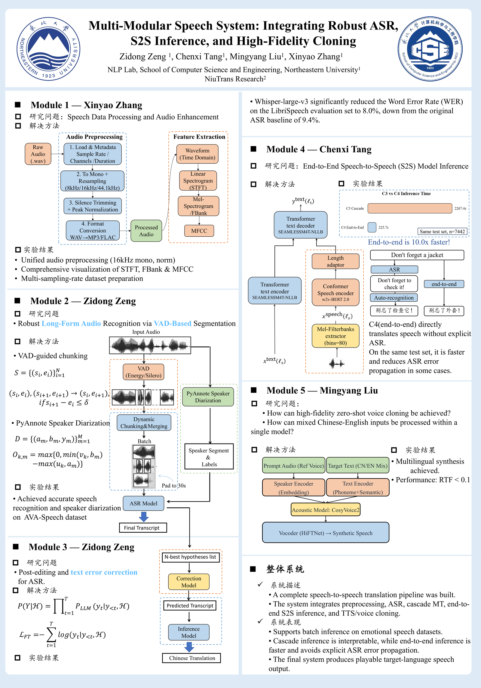
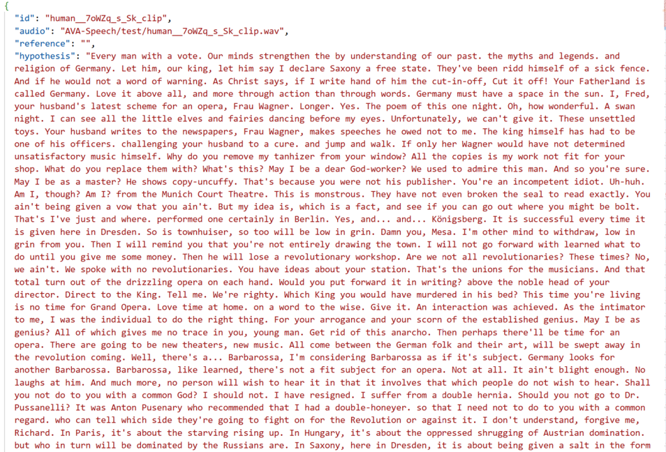
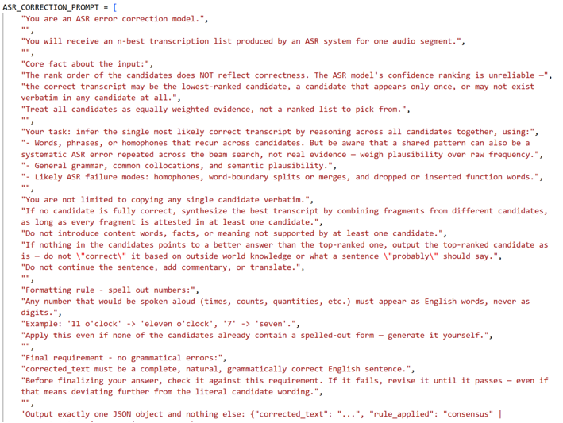
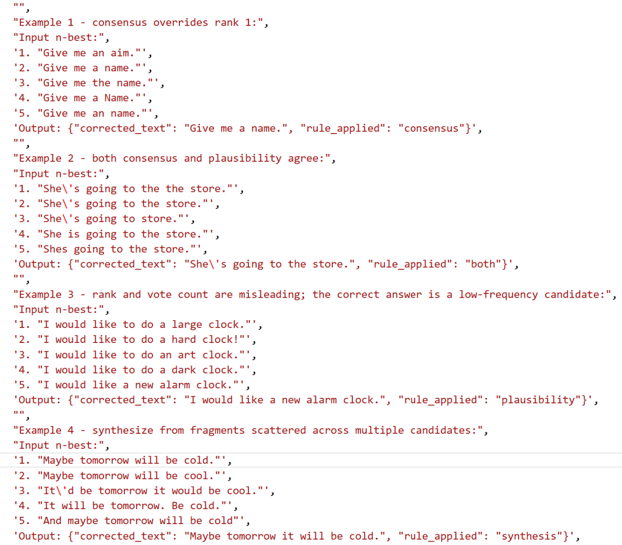
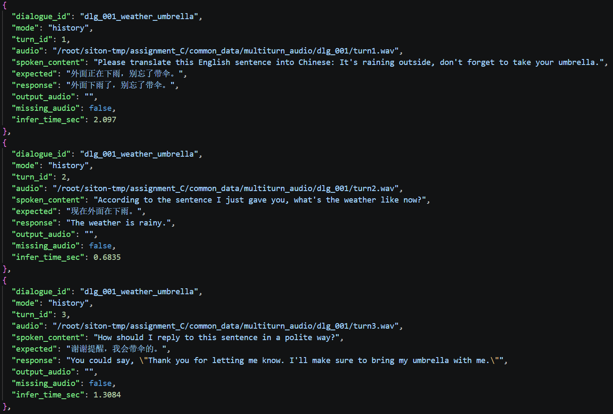
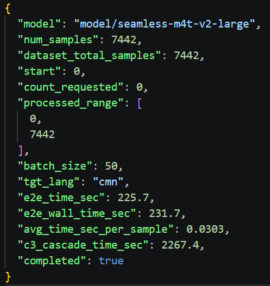
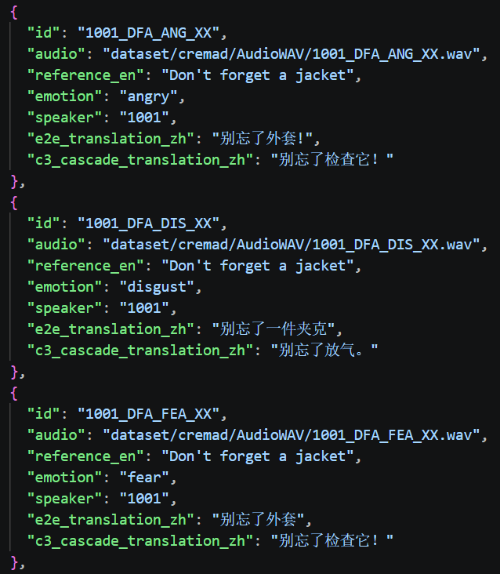

# Multi-Modular Speech System

**Integrating Robust ASR, Speech-to-Speech Inference, and High-Fidelity Voice Cloning**

本项目为 C 方向“多模态语音大模型”团队实训项目，围绕统一语音数据集构建一个从音频预处理、ASR 识别、级联语音翻译、端到端语音翻译到 TTS 语音合成的多模块系统。系统既支持传统级联路线 `Speech -> ASR -> Text Translation -> TTS`，也支持端到端路线 `Speech -> Speech/Text`，用于比较不同语音系统范式在鲁棒性、推理耗时、错误传播和语音风格保持方面的差异。

---

## 1. 项目概述

### 1.1 项目名称

`Multi-Modular Speech System: Robust ASR, S2S Inference and High-Fidelity Cloning`

### 1.2 项目目标

本项目面向英文情感语音理解、翻译与语音生成场景，目标是实现一套可复用的多模态语音处理流水线：

1. 对原始语音进行重采样、裁剪、归一化、格式转换和音频增强。
2. 使用 Whisper 系列模型完成英文 ASR，并输出 WER/CER、分段结果和可供下游使用的识别 JSON。
3. 构建级联系统，将 ASR 文本送入文本大模型进行纠错和中文翻译。
4. 构建端到端语音模型推理模块，直接从英文语音生成中文翻译文本或目标语音，并与级联系统对比。
5. 使用 CosyVoice2 完成文本转语音，将 C3/C4 的中文翻译结果合成为可播放语音，形成完整输入输出闭环。

### 1.3 当前完成情况

| 类型               | 完成情况                                                                                                                                                                                                               |
| ------------------ | ---------------------------------------------------------------------------------------------------------------------------------------------------------------------------------------------------------------------- |
| 基础要求           | 已覆盖 C1-C5 主线：音频处理、ASR、级联翻译、端到端翻译、TTS 合成。                                                                                                                                                     |
| 进阶要求           | 已实现或提供脚本支持：C1 音频增强与不同采样率；C2 VAD、长音频分段、说话人分离接口；C3 ASR 纠错、不同 LLM 后端；C4 Kimi-Audio S2S、Qwen2.5-Omni、情感/韵律保持、多轮语音对话；C5 多语种、语速、音色、情感和说话人控制。 |
| 支持的主要任务类型 | 语音预处理、ASR、英文语音到中文文本翻译、级联语音翻译、端到端 S2T/S2S、文本转语音、语音多轮对话实验。                                                                                                                  |
| 当前限制           | 部分大模型推理需要较大 GPU 显存；当前`scripts/run_full_c2_c3_pipeline.sh` 覆盖 C2+C3，C4/C5 需按后续命令接入或由总控脚本继续串联。                                                                                   |

---

## 2. 整体流程与模块结构

### 2.1 模块边界

| 模块 / 阶段       | 入口文件 / 入口函数                                                              | 主要职责                                                              | 输入                                | 输出                                                       |
| ----------------- | -------------------------------------------------------------------------------- | --------------------------------------------------------------------- | ----------------------------------- | ---------------------------------------------------------- |
| C1 音频处理与增强 | `C1_audio_processing/c1_advanced_augmentation.py`                              | 音频格式转换、重采样、归一化、速度/音量/噪声增强，可选 VAD 切分       | 原始 wav/flac/mp3 或音频目录        | 处理后的音频、增强音频、统计信息和可视化结果               |
| C2 ASR + VAD      | `C2_ASR/scripts/run_c2_vad_asr.sh`，核心代码 `C2_ASR/code/c2_asr.py`         | VAD 分段、Whisper ASR、n-best 识别、WER/CER 评测、可选说话人分离      | `dataset.json` 或 C1 输出音频     | `asr_predictions.json` 或 `asr_nbest_predictions.json` |
| C3 级联语音翻译   | `C3_cascade/scripts/run_c3_cascade.sh`，核心代码 `C3_cascade/code/c3/cli.py` | 读取 C2 ASR 结果，进行 ASR 后编辑/纠错，再调用文本 LLM 翻译成中文     | C2 的`asr_nbest_predictions.json` | C3 翻译结果 JSON，字段包含`translation_zh`               |
| C4 端到端语音推理 | `C4_e2e_package/C4_end2end/code/c4_e2e.py`                                     | SeamlessM4T/Qwen/Kimi 等端到端语音模型推理，直接输出中文翻译或语音    | 统一`dataset.json` 或 C1 音频目录 | `c4_results.json`，字段包含 `e2e_translation_zh`       |
| C5 TTS 合成       | `C5_TTS/c5_tts.py`，API 文件 `C5_TTS/c5_api.py`                              | 将 C3/C4 的中文文本转成语音，支持多语种、语速、音色、情感和说话人控制 | C3/C4 JSON 或单句文本               | wav 音频、批量合成目录、`c5_summary.json`                |

### 2.2 系统架构图或流程图

项目结构图已放置在：

```text
assets/pipeline_overview.png
```



### 2.3 一次完整任务的流程

完整流程如下：

1. 准备统一数据集 `common_data/dataset.json`，每条样本包含音频路径、英文转录文本、情感标签、说话人等字段。
2. C1 将原始音频统一处理为 16kHz 单声道，并可额外生成 8kHz、44.1kHz、速度扰动、音量扰动、噪声增强等版本。
3. C2 对音频执行 VAD 和 Whisper ASR，输出 one-best 或 n-best 识别结果，并计算 WER/CER。
4. C3 读取 C2 输出，先进行 ASR 纠错或文本整理，再调用 Qwen2.5 等文本模型翻译成中文。
5. C4 直接读取同一批音频，使用 SeamlessM4T 或 Qwen2.5-Omni 进行端到端语音翻译，并与 C3 的级联结果比较。
6. C5 读取 C3 的 `translation_zh` 或 C4 的 `e2e_translation_zh`，使用 CosyVoice2 合成最终中文语音。
7. 各模块将结果保存为 JSON、WAV、日志或评测报告，便于验收、复现和可视化展示。

---

## 3. 模型、数据集与外部资源

### 3.1 模型说明

| 模块        | 使用模型                                        | 模型来源                                                                                    | 推荐项目内或服务器路径           | 是否需要 GPU           | 是否需要联网运行                     |
| ----------- | ----------------------------------------------- | ------------------------------------------------------------------------------------------- | -------------------------------- | ---------------------- | ------------------------------------ |
| C2 ASR      | Whisper Large V3 / Whisper small / Whisper tiny | `https://huggingface.co/openai/whisper-large-v3`                                          | `model/whisper-large-v3`       | 推荐 GPU               | 下载模型时需要；本地权重就绪后可离线 |
| C3 纠错     | Qwen3-4B 或兼容文本模型                         | Hugging Face / ModelScope                                                                   | `model/Qwen3-4B`               | 推荐 GPU               | 本地权重就绪后可离线                 |
| C3 翻译     | Qwen2.5-1.5B-Instruct                           | `https://huggingface.co/Qwen/Qwen2.5-1.5B-Instruct`                                       | `model/Qwen2.5-1.5B-Instruct`  | 推荐 GPU               | 本地权重就绪后可离线                 |
| C4 S2T      | SeamlessM4T-v2-large                            | `https://huggingface.co/facebook/seamless-m4t-v2-large`                                   | `model/seamless-m4t-v2-large`  | 需要 GPU               | 本地权重就绪后可离线                 |
| C4 S2S      | Kimi-Audio-7B-Instruct                          | `https://huggingface.co/moonshotai/Kimi-Audio-7B-Instruct`                                | `model/Kimi-Audio-7B-Instruct` | 需要较大 GPU 显存      | 本地权重就绪后可离线                 |
| C4 Omni     | Qwen2.5-Omni-7B                                 | `https://huggingface.co/Qwen/Qwen2.5-Omni-7B`                                             | `model/Qwen2.5-Omni-7B`        | 需要 GPU               | 本地权重就绪后可离线                 |
| C4 情感评估 | emotion2vec+ large                              | ModelScope`iic/emotion2vec_plus_large`                                                    | `model/emotion2vec_plus_large` | 推荐 GPU，可小批量 CPU | 本地权重就绪后可离线                 |
| C5 TTS      | CosyVoice2-0.5B                                 | `https://huggingface.co/FunAudioLLM/CosyVoice2-0.5B` / ModelScope `iic/CosyVoice2-0.5B` | 由`COSYVOICE_MODEL` 指定       | 推荐 GPU               | 本地权重就绪后可离线                 |

示例模型下载命令：

```bash
# Hugging Face 镜像示例
export HF_ENDPOINT=https://hf-mirror.com
hf download facebook/seamless-m4t-v2-large --local-dir model/seamless-m4t-v2-large
hf download Qwen/Qwen2.5-Omni-7B --local-dir model/Qwen2.5-Omni-7B

# ModelScope 示例
python -c "from modelscope import snapshot_download; snapshot_download('iic/CosyVoice2-0.5B', local_dir='model/CosyVoice2-0.5B')"
```

### 3.2 数据集 / 示例数据说明

| 数据或文件        | 用途                                                                | 来源                                                               | 项目内相对路径                                             |
| ----------------- | ------------------------------------------------------------------- | ------------------------------------------------------------------ | ---------------------------------------------------------- |
| CREMA-D           | 英文情感语音，包含文本、情感、说话人信息，作为 C1-C5 统一主数据之一 | Kaggle`ejlok1/cremad`；GitHub `CheyneyComputerScience/CREMA-D` | 建议放置为`common_data/dataset/cremad/AudioWAV`          |
| TESS              | 英文情感语音补充数据                                                | Kaggle`ejlok1/toronto-emotional-speech-set-tess`                 | 可放置为`common_data/dataset/tess`                       |
| `dataset.json`  | C2/C3/C4 统一输入清单                                               | 由数据集音频和标注 CSV 构造                                        | `common_data/dataset.json`                               |
| C1 处理后短音频   | 验证 C4/C5 对 C1 输出的适配                                         | C1 生成                                                            | `C1_audio_processing/sample_data/augmented/clean` 等目录 |
| C1 长音频样例     | 长音频、噪声增强和鲁棒性实验                                        | C1 生成                                                            | `C1_audio_processing/sample_data/concatenated_audio`     |
| C4 多轮对话数据集 | 语音多轮上下文实验                                                  | 自行构造                                                           | `common_data/multiturn_dialogues.json`                   |

统一数据 JSON 示例：

```json
{
  "id": "1001_DFA_ANG_XX",
  "audio": "dataset/cremad/AudioWAV/1001_DFA_ANG_XX.wav",
  "text": "Don't forget a jacket",
  "emotion": "angry",
  "speaker": "1001",
  "duration": 2.0,
  "sample_rate": 16000
}
```

---

## 4. 环境安装

### 4.1 运行环境

| 项目                  | 要求                                                                                         |
| --------------------- | -------------------------------------------------------------------------------------------- |
| Python 版本           | Python 3.10 推荐                                                                             |
| 操作系统 / 服务器环境 | Linux 服务器推荐；Windows 可用于代码查看和轻量脚本编辑                                       |
| GPU 要求              | C2/C3 推荐 GPU；C4 Kimi/Qwen/Seamless 和 C5 CosyVoice 推荐 GPU；大模型需要充足显存           |
| 主要依赖              | PyTorch、transformers、torchaudio、librosa、ffmpeg、jiwer、funasr/modelscope、CosyVoice 依赖 |

### 4.2 安装步骤

基础语音环境示例：

```bash
conda create -n speech_tcx python=3.10 -y
conda activate speech_tcx

pip install torch torchaudio transformers accelerate librosa soundfile jiwer tqdm
pip install huggingface_hub modelscope funasr
```

C5 建议使用独立 CosyVoice 环境：

```bash
conda create -n cosyvoice python=3.10 -y
conda activate cosyvoice

git clone --recursive https://github.com/FunAudioLLM/CosyVoice.git
printf "setuptools<81\n" > /tmp/cons.txt
PIP_CONSTRAINT=/tmp/cons.txt pip install -r CosyVoice/requirements.txt

export COSYVOICE_REPO=/path/to/CosyVoice
export COSYVOICE_MODEL=/path/to/CosyVoice2-0.5B
```

常见问题：

- 模型路径不存在：检查 `model/xxx` 或环境变量是否指向本地权重目录。
- GPU 显存不足：减小 batch size，关闭不必要的语音输出，或只跑少量样本。
- Hugging Face 下载失败：可设置 `HF_ENDPOINT=https://hf-mirror.com`，或先本地下载后上传服务器。
- CosyVoice 依赖冲突：建议与 C1-C4 分环境运行。

---

## 5. 输入文件与配置文件说明

### 5.1 主要配置方式

| 配置方式                            | 作用                      | 需要修改的字段                              |
| ----------------------------------- | ------------------------- | ------------------------------------------- |
| 环境变量`MODEL`                   | C2 Whisper 模型路径       | 指向`model/whisper-large-v3` 等           |
| 环境变量`CORRECTION_MODEL`        | C3 ASR 纠错模型路径       | 指向 Qwen3 或兼容模型                       |
| 环境变量`TRANSLATION_MODEL`       | C3 翻译模型路径           | 指向 Qwen2.5-1.5B-Instruct                  |
| 环境变量`COSYVOICE_REPO`          | C5 CosyVoice 官方仓库路径 | 指向已 clone 的 CosyVoice                   |
| 环境变量`COSYVOICE_MODEL`         | C5 CosyVoice2 模型路径    | 指向 CosyVoice2-0.5B                        |
| 命令行参数`--dataset`             | C2/C4/C5 的输入 JSON      | 指向`common_data/dataset.json` 或上游输出 |
| 命令行参数`--outdir` / `OUTDIR` | 输出目录                  | 按实验名或模块名指定                        |

### 5.2 主要输入文件

| 输入文件                                                 | 用途                                           | 适用场景                |
| -------------------------------------------------------- | ---------------------------------------------- | ----------------------- |
| `common_data/dataset.json`                             | 统一音频清单，包含音频路径、文本、情感、说话人 | C2/C3/C4 主实验         |
| `C1_audio_processing/sample_data/sample_manifest.json` | C1 短音频处理结果清单                          | C4 适配 C1 输出         |
| `C2_ASR/outputs/.../asr_nbest_predictions.json`        | C2 ASR 输出                                    | C3 级联翻译             |
| `C3_cascade/outputs/.../c3_predictions.json`           | C3 中文翻译结果                                | C4 对比、C5 语音合成    |
| `C4_end2end/outputs_core/c4_results.json`              | C4 端到端中文翻译结果                          | C5 语音合成、C3/C4 对比 |
| `common_data/multiturn_dialogues.json`                 | 多轮语音对话样本                               | C4 进阶多轮对话实验     |

---

## 6. 完整流程 Demo 运行

### 6.1 Demo 样例说明

| Demo               | 输入文件 / 输入内容                         | 演示目的                                    |
| ------------------ | ------------------------------------------- | ------------------------------------------- |
| C2+C3 级联语音翻译 | `common_data/dataset.json` 或 C2 默认数据 | 验证 ASR、ASR 纠错、文本翻译和中间结果保存  |
| C4 端到端语音翻译  | `common_data/dataset.json` 或 C1 音频目录 | 验证不经过显式 ASR 的英文语音到中文文本翻译 |
| C5 批量 TTS        | C3 或 C4 输出 JSON                          | 验证中文翻译文本到语音的批量合成            |
| C4 多轮语音对话    | `common_data/multiturn_dialogues.json`    | 验证 Qwen2.5-Omni 对语音上下文的利用能力    |

### 6.2 运行命令

当前仓库提供的主脚本覆盖 C2+C3：

```bash
cd /root/siton-tmp/assignment_C
conda activate speech_tcx

export MODEL=/root/siton-tmp/assignment_C/model/whisper-large-v3
export CORRECTION_MODEL=/root/siton-tmp/assignment_C/model/Qwen3-4B
export TRANSLATION_MODEL=/root/siton-tmp/assignment_C/model/Qwen2.5-1.5B-Instruct

RUN_ID=demo \
DATASET=/root/siton-tmp/assignment_C/common_data/dataset.json \
bash scripts/run_full_c2_c3_pipeline.sh
```

单独运行 C2：

```bash
DATASET=/root/siton-tmp/assignment_C/common_data/dataset.json \
OUTDIR=/root/siton-tmp/assignment_C/C2_ASR/outputs/c2_vad_asr/demo \
MODEL=/root/siton-tmp/assignment_C/model/whisper-large-v3 \
ASR_MODE=nbest \
bash C2_ASR/scripts/run_c2_vad_asr.sh
```

单独运行 C3：

```bash
C2_JSON=/root/siton-tmp/assignment_C/C2_ASR/outputs/c2_vad_asr/demo/asr_nbest_predictions.json \
OUTDIR=/root/siton-tmp/assignment_C/C3_cascade/outputs/c3-corrected/demo \
bash C3_cascade/scripts/run_c3_cascade.sh
```

运行 C4 核心端到端翻译。注意：当前 GitHub 仓库中 C4 代码位于 `C4_e2e_package` 下；如果组长将其复制到项目根目录的 `C4_end2end`，命令路径可相应简化。

```bash
python C4_e2e_package/C4_end2end/code/c4_e2e.py \
  --dataset /root/siton-tmp/assignment_C/common_data/dataset.json \
  --model /root/siton-tmp/assignment_C/model/seamless-m4t-v2-large \
  --outdir /root/siton-tmp/assignment_C/C4_end2end/outputs_core \
  --batch_size 50
```

C4 适配 C1 输出音频目录：

```bash
python C4_e2e_package/C4_end2end/code/c4_e2e.py \
  --input_dir /root/siton-tmp/assignment_C/C1_audio_processing/sample_data/augmented/clean \
  --model /root/siton-tmp/assignment_C/model/seamless-m4t-v2-large \
  --outdir /root/siton-tmp/assignment_C/C4_end2end/outputs_core_c1_clean \
  --batch_size 16
```

运行 C5 读取 C4 输出：

```bash
conda activate cosyvoice
export COSYVOICE_REPO=/root/siton-tmp/lmy/CosyVoice
export COSYVOICE_MODEL=/root/siton-tmp/lmy/CosyVoice2-0.5B

python C5_TTS/c5_tts.py \
  --dataset /root/siton-tmp/assignment_C/C4_end2end/outputs_core/c4_results.json \
  -o /root/siton-tmp/assignment_C/C5_TTS/outputs/from_c4
```

### 6.3 关键参数说明

| 参数                        | 说明                                     |
| --------------------------- | ---------------------------------------- |
| `DATASET` / `--dataset` | 输入数据集或上游模块输出 JSON            |
| `MODEL` / `--model`     | 本地模型路径                             |
| `OUTDIR` / `--outdir`   | 输出目录                                 |
| `ASR_MODE`                | C2 输出模式，支持`onebest` / `nbest` |
| `VAD_BACKEND`             | C2 VAD 后端，支持`energy` / `silero` |
| `ENABLE_PYANNOTE`         | 是否启用说话人分离                       |
| `--batch_size`            | C4 批量推理大小                          |
| `--start` / `--count`   | C4/Qwen 等脚本中控制样本范围             |
| `--return_audio`          | Qwen2.5-Omni 是否同时生成语音            |

### 6.4 运行成功的判断方式

- 终端显示模块运行完成，无 Python traceback 或 CUDA OOM。
- C2 输出目录中生成 `asr_predictions.json` 或 `asr_nbest_predictions.json`。
- C3 输出目录中生成包含 `translation_zh` 字段的结果 JSON。
- C4 输出目录中生成 `c4_results.json` 和 `c4_summary.json`，且每条样本包含 `e2e_translation_zh`。
- C5 输出目录中生成 wav 音频文件和汇总结果。

---

## 7. 输出文件与结果说明

### 7.1 主要输出文件

| 输出文件                                          | 生成模块 / 阶段 | 格式             | 说明                                                     |
| ------------------------------------------------- | --------------- | ---------------- | -------------------------------------------------------- |
| `C1_audio_processing/sample_data/...`           | C1              | WAV / JSON / PNG | 处理后音频、增强音频、频谱或统计结果                     |
| `C2_ASR/outputs/.../asr_predictions.json`       | C2              | JSON             | one-best ASR 识别结果                                    |
| `C2_ASR/outputs/.../asr_nbest_predictions.json` | C2              | JSON             | n-best ASR 识别结果，供 C3 纠错使用                      |
| `C3_cascade/outputs/.../c3_predictions.json`    | C3              | JSON             | 级联纠错与翻译结果，核心字段`translation_zh`           |
| `C4_end2end/outputs_core/c4_results.json`       | C4              | JSON             | 端到端翻译结果，核心字段`e2e_translation_zh`           |
| `C4_end2end/outputs_core/c4_summary.json`       | C4              | JSON             | C4 模型、样本数、耗时等汇总信息                          |
| `C4_end2end/outputs_qwen25_omni...`             | C4 进阶         | JSON / WAV       | Qwen2.5-Omni S2T/S2S、情感提示、rerank、参考音频实验结果 |
| `C5_TTS/outputs/...`                            | C5              | WAV / JSON       | TTS 合成音频和批量合成摘要                               |

### 7.2 结果图或截图

**C1**


**C2-C3**







**C4**







**C5**


---

## 8. 协作实现说明

团队按 C1-C5 模块拆分实现，每个模块维护相对独立的入口脚本、输出目录和结果格式。模块间通过 JSON 文件传递数据，避免直接耦合模型对象或运行环境。

主要约定如下：

- 统一数据入口为 `dataset.json`，字段尽量保持 `id`、`audio`、`text`、`emotion`、`speaker`。
- C2 输出 ASR 文本，C3 读取 C2 JSON 并输出 `translation_zh`。
- C4 直接读取音频并输出 `e2e_translation_zh`。
- C5 兼容读取 `translation_zh`、`e2e_translation_zh`、`c3_cascade_translation_zh` 等字段，优先合成中文翻译。
- 大模型权重不进入 Git 仓库，通过环境变量或命令行参数指定路径。
- 每个模块保留独立 Demo 命令，便于单模块验收；总控脚本可在这些入口上继续封装。

---

## 9. 已知问题与改进方向

| 问题                                 | 当前原因                                                       | 可能改进                                                   |
| ------------------------------------ | -------------------------------------------------------------- | ---------------------------------------------------------- |
| C4 S2S 情感保持不稳定                | 通用端到端模型对指定情感风格控制有限，参考音频可能干扰内容翻译 | 引入更可靠的情感 TTS                                       |
| 长音频、多说话人和强噪声场景仍有误差 | VAD、ASR 和翻译都会受切分质量影响                              | 优化 VAD 合并策略，引入说话人感知的文本组装和鲁棒 ASR 模型 |

---

## 10. Repository Structure

```text
scripts/
  |-- logging.sh
  |-- run_full_c2_c3_pipeline.sh

C1_audio_processing/
  |-- c1_advanced_augmentation.py
  |-- c1_dif_resample_rate.py
  |-- 简单说明.txt

C2_ASR/
  |-- code/
  |-- data/
  |-- scripts/

C3_cascade/
  |-- code/
  |-- c2_code/
  |-- scripts/

C4_e2e_package/
  |-- README_C4.md
  |-- C4_end2end/code/
  |-- scripts/

C5_TTS/
  |-- c5_tts.py
  |-- c5_api.py
  |-- benchmark.py
  |-- emotion_control.py
  |-- multilingual.py
  |-- speaker_clone.py
  |-- speed_timbre.py
  |-- visualize_results.py

assets/
  |-- pipeline_overview.png
```

---

## 11. License

This project is developed as part of the NEU NLP Lab / NiuTrans multimodal speech training project.
